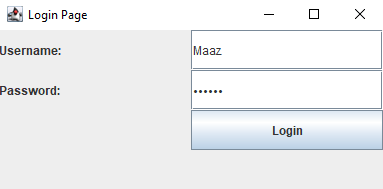
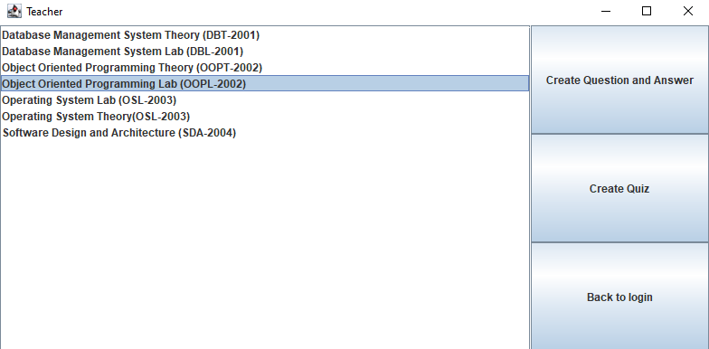
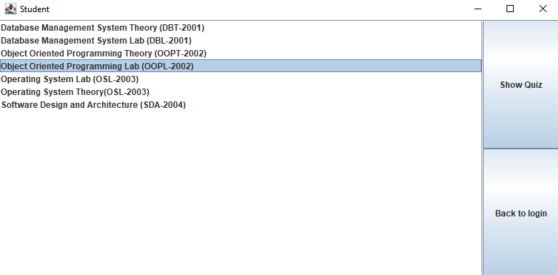

# 📚 Quiz Management System – Java GUI OOP Project (Version 2)

## 🚀 Overview

A **Java Swing–based Quiz Management System** designed as a collaborative **2nd Semester OOP project** at DHA Suffa University.
This desktop application enables **teachers** to create, manage, and evaluate quizzes, while **students** can securely attempt them within a time limit.

🏆 The project showcases advanced **Object-Oriented Programming**, **MVC architecture**, and **GUI-based system design**, similar to Learning Management Systems (LMS) used in education.

---

## 🛠️ Tech Stack

- **Language:** Java
- **GUI Framework:** Java Swing
- **Persistence:** Java File I/O (no database required)
- **Architecture:** MVC
- **OOP Concepts:** Inheritance, Encapsulation, Composition, Association

---

## 🎯 Skills Demonstrated

- Java Swing GUI design & event handling
- File I/O for data storage and retrieval
- Implementation of MVC structure
- Role-based authentication (Teacher & Student)
- Real-time quiz timer and validation logic
- Randomized question selection
- Auto-evaluation and result analytics

---

## 👨‍🏫 Teacher Features

- 🔑 Secure login with credentials
- 📚 Manage multiple course question banks
- 🧩 Create quizzes with date, duration, and marks
- ⚡ Auto-check submissions instantly
- 📊 View quiz reports and performance analytics

---

## 👨‍🎓 Student Features

- 🔐 Login with registered student credentials
- 📖 View available courses and quizzes
- ⏳ Attempt quizzes under a timer
- 🎯 Receive instant graded results
- ✅ Randomized question order for fairness

---

## 🧪 How to Run

### 🖥️ Using IntelliJ IDEA

1. Open the project folder (**SemesterProject**) in IntelliJ IDEA.
2. Navigate to: `src/com/second/Main.java`
3. Run the `Main` class.
4. Use the credentials below:

**Teacher Login**  
Username: `Sumaira`  
Password: `admin123`

**Student Login**  
Username: `Maaz` / `Rumaisa` / others  
Password: `stu123`

---

## 🖼️ Version 1 UI (Classic Layout)

| Login | Teacher Dashboard | Student Attempt |
|:--:|:--:|:--:|
|  |  |  |

---

## 🪄 Version 2 UI (Improved Layout)

| Login | Teacher Page | Make Quiz | User Type Selection |
|:--:|:--:|:--:|:--:|
|  |  |  |  |

---

## 📈 Analytics Example

- ✅ Auto-generated results with scoring
- 📊 Performance tracking for each student
- 🧠 Highlights frequently missed questions
- 📝 Attendance marking (Present / Absent based on quiz attempt)

---

## 🔐 Security & Validation

- ⏰ Time-bound quizzes (strict duration control)
- 🔄 Randomized question sequence per attempt
- 🎯 Role-based system separation (Teacher vs Student)

---

## 🧠 Learning Outcomes

- Practical application of **OOP concepts**
- Understanding of **GUI design** using Swing
- Implementation of **event-driven programming**
- Experience in **file-based data persistence**
- Collaboration and version control with shared design logic

---

## 📄 License

For educational and learning purposes only — free to reuse or modify with credit.

---

## 👥 Developers

**Muhammad Maaz Khan**  
**Rumaisa Fatima**  
📚 DHA Suffa University — 2nd Semester (Object Oriented Programming Lab)  
🧠 Collaborative project showcasing GUI-based OOP design with slight functional and UI variations across versions.